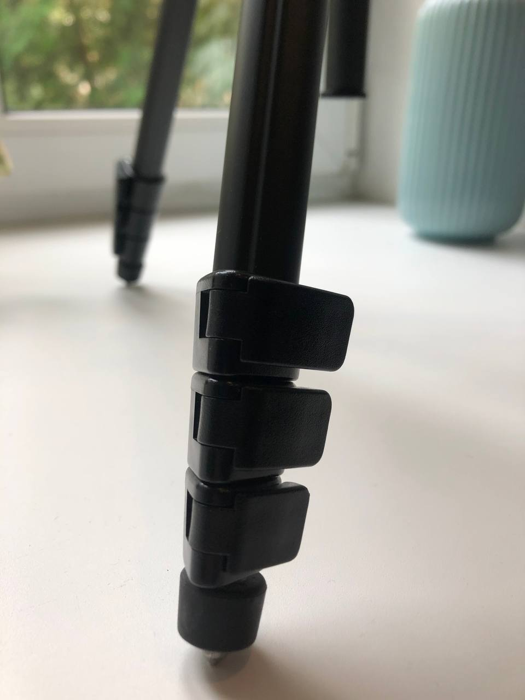

# Инструкция для работы Markdown 

## выделение текста 

чтобы выделить текст курсивом, необходимо обрамить его звездочками (*) или знаком нижнего подчеркивания (_). например, *вот так* или _вот так_

чтобы выделить текст полужирным, необходимо обрамить его двойными звездочками (**) или двойиным знаком нижнего подчеркивания (__).  например, **вот так** или __вот так__

альтернативные способы выделения текста жирными или курсивом нужны для того, чтобы мы могли совмещать оба этих способа. Например, _текст может быть выделен курсивом и при этом быть **полужирным**_

## списки 
чтобы выделить ненумерованный список, используйте(*)

чтобы добавить ненумерованные списки, необходимо пункты выделить звездочкой (*) или знаком +.
например, вот так 
* Элемент 1
* Элемент 2
* Элемент 3
+ Элемент 4

чтобы добавить нумерованные списки, необходимо пункты просто нумеровать. 
например, вот так 
1. Первый пункт 
2. Второй пункт 
 

## работа с изображениями 
чтобы вставить изображение в текст, достаточно написать следующее:

## ссылки 

## работа с таблицами 

## цитаты 

## Заключение
